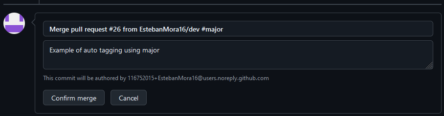
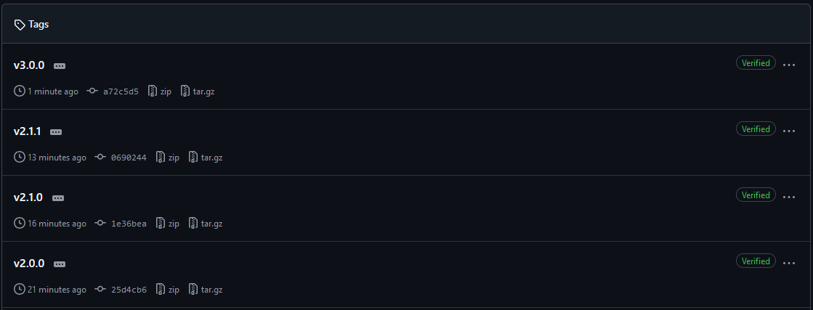

# GitHub Actions: Auto-tagging Workflow (main.yml)

This GitHub Actions workflow automatically generates a new version tag when a pull request is merged into the `main` branch.

## How It Works

- The workflow is triggered when a pull request to the `main` branch is **closed** and **merged**.
- It automatically generates a new semantic version tag based on the changes, using the [`phish108/autotag-action`](https://github.com/phish108/autotag-action) GitHub Action.
- Depending on the type of change, the version is incremented following **Semantic Versioning** conventions (`MAJOR.MINOR.PATCH`).

## Workflow Overview

1. **Checkout the repository**: The workflow first checks out the latest version of the repository to ensure it has access to all the necessary files.
2. **Set up Node.js**: It sets up Node.js (version 18 in this case) as the project may require it to install dependencies or execute scripts.
3. **Install dependencies**: The workflow installs any required project dependencies by running `npm install`.
4. **Auto-tagging**: The `phish108/autotag-action` analyzes the merged changes and automatically updates the version number (major, minor, or patch) and creates a tag.

### Important Note About Patch Increments

- **Patch** version bumps happen **by default** for any merged changes that don’t explicitly specify a `#minor` or `#major`. This means you do **not** need to add `#patch` to your commit message. For small bug fixes, the version will increment automatically from, for example, `v1.3.0` to `v1.3.1`.

### Example Flow

1. A pull request is merged with a new feature:
    - The version is bumped from `v1.2.3` to `v1.3.0` (**Minor** version increase).
  
2. A bug fix is merged:
    - The version is bumped from `v1.3.0` to `v1.3.1` (**Patch** version increase by default).

3. A breaking change is merged:
    - The version is bumped from `v1.3.1` to `v2.0.0` (**Major** version increase).

### Semantic Versioning

- **MAJOR** version (`v2.0.0`): Introduces incompatible API changes, meaning existing users will need to modify their usage of the project.
- **MINOR** version (`v1.1.0`): Adds new features in a backwards-compatible manner, meaning existing users can upgrade without needing to change their usage.
- **PATCH** version (`v1.0.1`): Includes bug fixes that do not affect the project's functionality or API.

---

## Images for Major Version Increment Example

Below is an example of how the workflow processes a **major** version increment. Suppose the current version is `v2.1.1` and a breaking change is merged, resulting in a bump to `v3.0.0`:

1. **Merge Confirmation**: The first image shows the pull request confirmation where `#major` is indicated in the commit message, triggering a major version bump.

   

2. **Version Increment**: The second image displays the new version tag `v3.0.0` created after the merge, showing the successful major version increment.

   

# GitHub Actions: Pull Request Verification Workflow (pullrequest.yml)

This workflow verifies pull requests targeting the `main` branch to ensure they build successfully.

## How It Works

- The workflow is triggered by **open pull requests** to the `main` branch.
- It verifies that the code builds correctly by performing the following steps:

### Workflow Overview

1. **Checkout repository**: The workflow checks out the repository to access the latest code.
2. **Set up Node.js**: It configures Node.js version 18 for the project.
3. **Cache npm dependencies**: The workflow caches npm dependencies to speed up future builds by storing the `node_modules` folder.
4. **Install dependencies**: It installs project dependencies with `npm install`.
5. **Clean lib folder**: Removes the `lib` folder to ensure a clean build.
6. **Build project**: Finally, it runs the `npm run ci` command to build the project and verify that it compiles successfully.